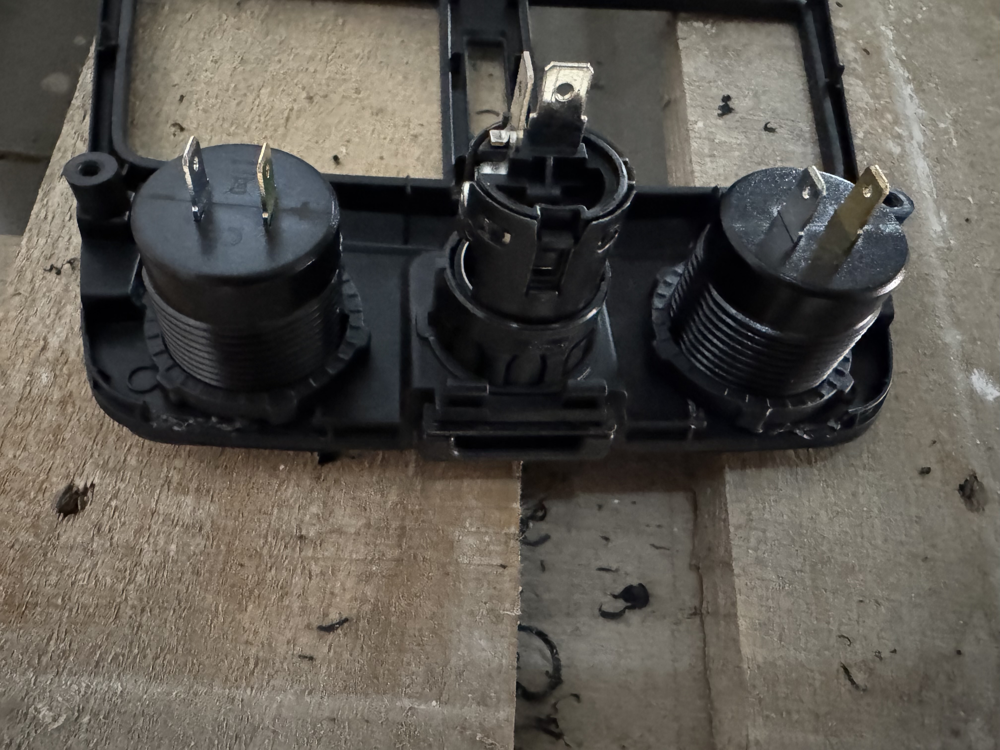

# How to add USB-C to Honda Clarity PHEV

This guide will walk you through the process of adding modern USB-C charging
ports to your Honda Clarity PHEV, both in the front niche and the rear console.
This is a relatively simple modification that can be done with basic tools and
some patience.

## Tools and spares needed

- Pry tool
- Screwdriver or power drill
- Step drill
- Wire strippers
- Soldering iron, solder, flux
- Spare wiring
- Multimeter
- USB-C charging sockets (bought mine from AliExpress)
- TESA Automotive fabric tape
- Heat-shrinkable tubing (and heat gun) or insulation tape

---

## Part 1: Front niche Installation

This section covers the installation in the front panel that houses the 12V
power outlet.

### 1. Disassembly

First, you need to remove the panel.

_This is the area we will be working on._

_Use a pry tool to gently pop out the panel from the back where sockets._
There is keyless access antenna behind that panel. You should unscrew it.

_There are a few clips holding it in place at front side. Be careful not to
break them how I almost do._

_Pull out the panel with the front side facing first._

_Once the panel is loose, you can disconnect the wiring harness._

### 2. Drilling and Chargers Installation

Now it's time to make space for the new USB-C sockets and connect them.

_Use a step drill to create the holes for the new sockets. Measure the diameter
of your USB-C chargers to ensure a snug fit._

_The panel with the new holes drilled and charger installed._

_The removed panel ready to install_

But we cannot install the panel now because there is a keyless access antenna
bracket behind the panel. It needs to be removed, and a space cut out for the
chargers.

_Drilling bracket started_

_Don't forget to connect antenna. I put it behind main bracket and tied it with
nylon ties._

_Cut and try to fit panel until it fits completely_

### 3. Wiring Preparation

Next, prepare the wiring to power the new sockets.
We will take power from stock cigarette lighting socket.
Lets use our spare wiring to create Y-connector that powers additional chargers.

_Prepare your spare wiring and soldering tools._

Measure and strip two pieces of spare wire, 15-20 cm long.

_Solder the wires to create a Y-splitter. This will allow you to power both the
original 12V socket and the new USB-C sockets._

_Use heat shrink tubing to insulate the solder joints. After shrinking wrap wires
with fabric tape_

Now time to connect our new harness to wires of the cigarette lighter power
connector.

_Remove part of the insulation after the connector that powers stock cigarette lighter._

_Use a multimeter to check the voltage and polarity of the original socket's connector._

_Solder your new wiring harness to the original connector wires maintaining polarity_

_Connect your new wiring harness to new USB-C chargers and check panel fit._

_The back of the panel with all sockets wired up. And antenna tied to inner bracket_

_Front chargers ready_

## Part 2: Rear Console Installation

### 1. Disassembly rear console

For the rear console, the process is similar and involves accessing the power
source from the rear 12V outlet.

The rear panel is very easy to remove—just pull it toward you firmly.

_Rear pannel with air outlets removed, view on inside air ducts_

### 2. Drilling and Rear chargers Installation

_The chargers I prepared for installation didn't quite fit, or rather, the nuts
that secure them didn't fit, so I had to remove some plastic from the inside
around the intended installation site—on either side of the standard
cigarette lighter socket._

_Finally, they got in._

_Checking how they fit_

### 3. Wiring and assembling

We do the rear wiring (Y-connector) in the same way as the front wiring.

_Then connect it to original socket's connector wires._

_Solder firmly_

_And wrap all additional harness in fabric tape_

Now, simply reverse the disassembly process.
Just carefully snap the console panel back into place.

_Final result of rear panel with chargers and cables plugged in._

Enjoy your new, modern charging setup!

---
